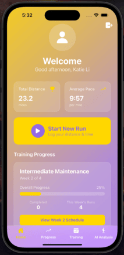

# Stride

 

## Description

Stride is a mobile fitness app built with **React Native** and **Expo**, designed for runners to track workouts, follow structured training plans, and monitor progress. Developed by Katie Li.

---

## Features

- **Login / Signup**: Enter your email and create a password. Two factor authentication supported.
- **Home Dashboard**:
  - Weekly mileage and pace statistics
  - Allows users to log their runs (distance, time, type of workout)
  - Training plan progress bar and weekly goals
- **Training Plans**:
  - Display of current training plan and active week
  - Button to toggle and view the current week's schedule
  - Currently we have a beginner plan and an intermediate maintenance plan. We are working on adding more!
- **Progress and Statistics**:
  - Progress graph of average pace over time
  - List of past runs with details like distance and pace
- **AI Form Analyzer (NEWEST FEATURE!!)**:
  - Upload a clear video of yourself running and get feedback on how to improve your running posture.
  - Implemented using TensorFlow and MoveNet.

---

## Tech Stack

- React Native (with Expo)
- Form Analyzer: TensorFlow, MoveNet
- Backend: PostgreSQL database, Supabase

## Demo Images

